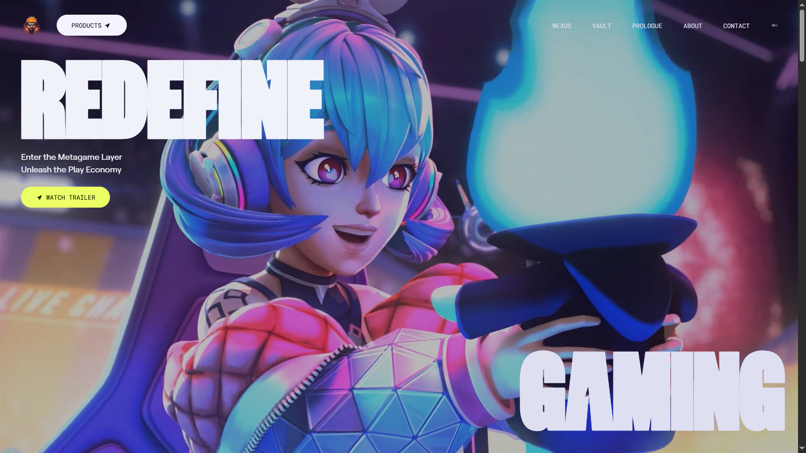
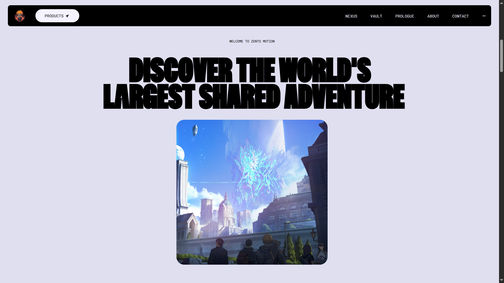
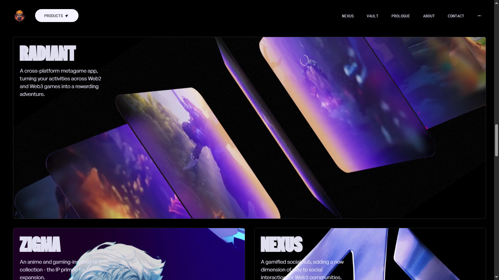
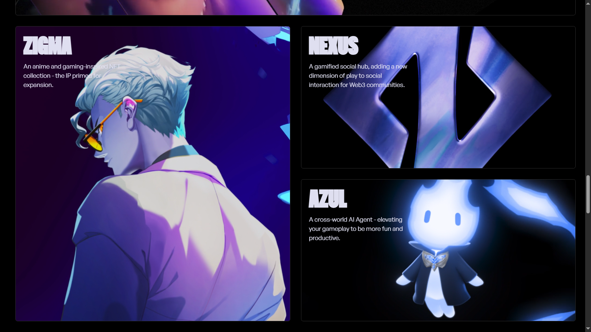
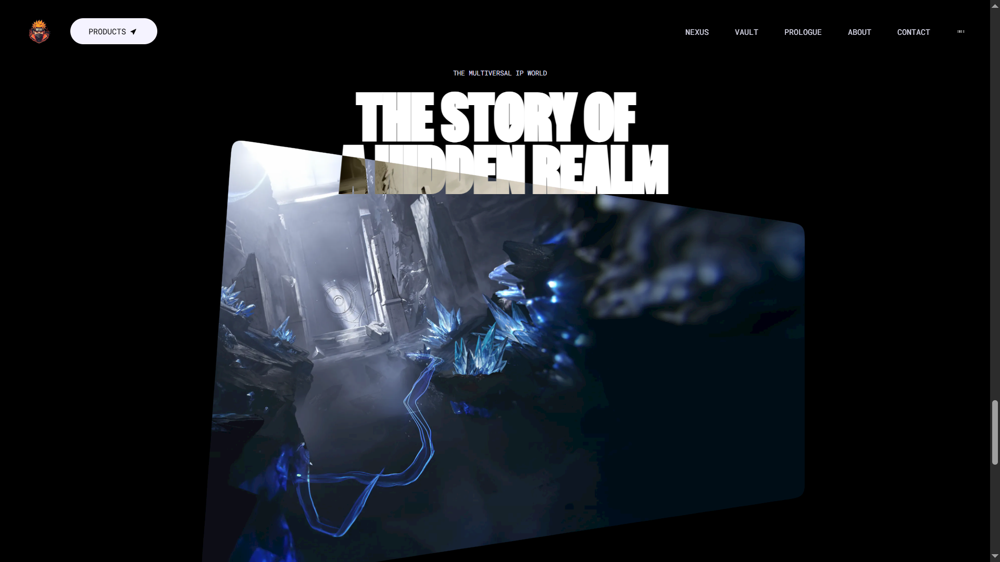
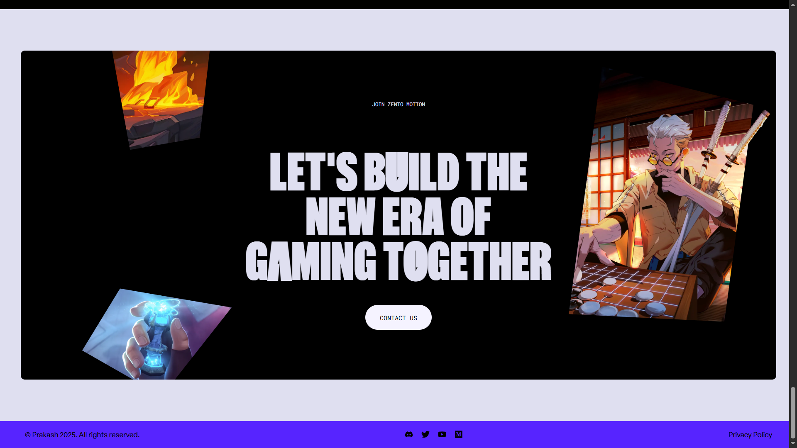

# Zento Motion

Zento Motion is a visually captivating, scroll-animated website inspired by Zentry. Designed to deliver a luxurious, modern feel, this project showcases advanced frontend techniques such as scroll-triggered animations, geometric transitions, and immersive video storytelling. Built using **React**, **GSAP**, and **Tailwind CSS**, it emphasizes smooth responsiveness and an engaging UI/UX.

---

## ✨ Features

- **Scroll-Based Animations**  
  Dynamic effects triggered on scroll for an engaging user journey.

- **Clip Path Shaped Animations**  
  Unique geometric transitions built with CSS `clip-path` to create visually stunning motion design.

- **3D Hover Effects**  
  Interactive 3D transformations that respond to cursor movement, enhancing interactivity.

- **Video Transitions**  
  Integrated cinematic video storytelling for seamless scene shifts and narrative flow.

- **Smooth UI/UX**  
  Fluid, polished interactions designed for maximum usability and elegance.

- **Fully Responsive**  
  Mobile-first design with flawless adaptation across all screen sizes.

- **Modular Architecture**  
  Clean codebase using reusable components for scalability and maintainability.

---

## ⚙️ Tech Stack

- **React.js** — JavaScript library for building user interfaces
- **GSAP** — Animation library for high-performance visual effects
- **Tailwind CSS** — Utility-first CSS framework for styling
- **Vite** — Fast and modern frontend build tool
- **HTML/CSS** — Markup and styling structure

---

## 🚀 Getting Started

### 1. Clone the Repository

```bash
git clone https://github.com/impcakash/zento-motion.git
```

### 2. Navigate to Project Directory

```bash
cd zento-motion
```

### 3. Install Dependencies

```bash
npm install
```

### 4. Start the Development Server

```bash
npm run dev
```

---

## 🖼️ Screenshots

  
  
  
  
  


---

## 🌐 Live Demo

👉 [View Deployed Website](https://zento-motion.netlify.app/)
